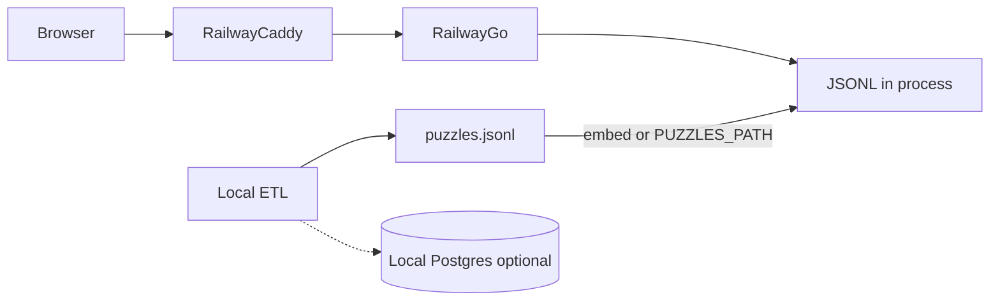

# EtymoloGuessr

**Status (verified against `main` @ `63659d4`):** v1 is playable locally, including the gloss-aligned homograph allowlist. Python ETL writes puzzle rows (JSONL and/or Postgres), a Go API serves one at a time (hiding the answer until submit), and a React UI plays Easy and Hard. Compose runs **Postgres 16 + API**; the frontend is still **Vite/`pnpm` locally** (not a Compose service). Railway-ready code (JSONL catalog, frontend Dockerfile/Caddy, `PORT`) is on main. Committed `data/` is gitignored stubs — load fixtures or generate before playing against real rows. This plan is the product/architecture source of truth in-repo; Agent Store copies live under Context `docs/`. Layer READMEs hold commands.

Wiktionary-derived data is noisy and **has no meanings**, so the pipeline joins glosses from kaikki/wiktextract and **prefers semantic-shift pairs** so multiple-choice is not trivial (EN *father* / DE *Vater* both mean “father”).

## Product (v1, shipped)

**Easy** (`/easy`): two modern words (EN / ES / PT / DE) on index cards → pick the common ancestor’s meaning from 4 post-its → on submit, cards/choices hide and a read-only etymology graph appears (ink edges **with** relation labels). Index cards have an Explain control for the leaf gloss.

**Hard** (`/hard`): same puzzle family, but only rows with **≥ 4 graph nodes**. **No nodes start on the blotter** — leaves and ancestors all sit in a post-it palette. Place every card (click or drag), then draw directed edges **child → ancestor**. Player edges have no relation-type labels. Submit is disabled until every node is placed (hint: “Build the graph!”). Score is an exact directed edge-set match (ignore order and `reltype`).

**Home** (`/`): Easy / Hard stamps. React Router, not in-memory screen state.

**Out of scope for v1:** accounts, scoring persistence, leaderboards (`users` / `scores` tables exist locally so later work does not rewrite schema). Daily challenge / explore-the-full-graph can wait. No dark theme (paper metaphor). Partial credit for hard edges (precision/recall) is optional later. **Hosted Postgres is not part of v1 production** (see Railway below).

**License:** etymology-db is [CC BY-SA 3.0](https://github.com/droher/etymology-db). Attribute Wiktionary + etymology-db in the UI colophon; derived puzzle data stays share-alike. Do **not** commit raw dumps or `data/derived/` graph artifacts. A ~5 MB production `puzzles.jsonl` snapshot may be committed or CI-baked for Railway (dumps stay gitignored).

## Why not query the live etymology graph at request time

Pregenerate puzzles. Serving is “pick a row, hide the answer, check a submission.” The graph walk, LCA search, gloss join, and distractor generation are slow, messy, and should be inspectable offline.

```mermaid
flowchart LR
  refresh[etl refresh]
  raw[data/raw]
  graph[data/derived graph plus glosses]
  gen[etl generate]
  jsonl[puzzles.jsonl]
  localPg[(Local Postgres)]
  api[Go API]
  ui[React Vite]
  refresh --> raw
  raw --> graph
  graph --> gen
  gen --> jsonl
  gen --> localPg
  localPg --> api
  jsonl -.->|prod boot| api
  api --> ui
```

**Local loop:** `docker compose up --build -d` (Postgres 16 + API on `:8080`), `uv run etl reset --all --reload --fixtures` for a tiny playable set, `cd frontend && pnpm dev` (Vite proxies `/api` → `:8080`). Full Wiktionary puzzles: `etl refresh` then `etl generate --db` and/or `--jsonl` (see [etl/README.md](etl/README.md)). Frontend is **not** in Compose. Production will load JSONL in-process instead of hosted Postgres.

## Data pipeline (Python CLI) — as built

Typer app: `uv run etl …`. Staged artifacts so generate does not re-download or rebuild the graph every time. Config in [etl/config.yaml](etl/config.yaml). `DATABASE_URL` overrides `database_url` in config. Large dumps stay in `data/` and are **gitignored**; pin source URLs in config (checksums optional, currently unset).

Source: [droher/etymology-db](https://github.com/droher/etymology-db) (`etymology.parquet`, Dec 2023). Edges: `term` / `lang` → `reltype` → `related_term` / `related_lang`. Glosses from [kaikki.org](https://kaikki.org/) / wiktextract. English gloss is canonical for v1.

### Layout

- `data/raw/` — parquet, gloss JSONL, checksums, `manifest.json`, `NOTICE`
- `data/derived/` — filtered edges parquet, `gloss_index.json`, `lemma_index.json`, `etym_parents.json`
- `data/puzzles/` — optional JSONL snapshots (not in git today; a production snapshot is part of cloud-deploy)
- `data/reports/` — `funnel.json`, `stats.json`
- `etl/fixtures/` — tiny committed slice for tests and `--fixtures`

### Current generate defaults (`etl/config.yaml`)

- `n: 0` — emit every survivor (full pass)
- `min_quality: 4`
- `max_nodes: 9` (graphs larger than 9 are `too_big`; no minimum at generate time)
- `n_choices: 4`
- `seed: 89`

### Stages

1. **Reduce graph** — leaf langs English / Spanish / Portuguese / German; ancestor allowlist in config (Latin through PIE, plus Ancient Greek, Arabic, Hebrew, Persian, Nahuatl, Sanskrit, …); keep `inherited_from`, `borrowed_from`, `derived_from`, `root`, `cognate_of`, `doublet_with`; drop null related terms, MWEs, affix noise. Then **align ancestor edges** to the winning-gloss parent list (`etym_parents.json`): drop dump ancestor edges whose `related_term` is not in that list; fallback if filtering would isolate the node; never filter non-ancestor reltypes (`cognate_of`, `doublet_with`).
2. **Index glosses** — first *lexical* gloss per `(lang, term)`; skip `form_of` / grammatical-form senses; strip leading case-government labels (`[with genitive]`, `[of place]`); join colon-ending qualifier lists onto the continuation (`Of a person:` + `smug` → one gloss). Qualifier-only senses are skipped. Form-only entries inherit the citation lemma’s gloss and are recorded in `lemma_index.json`. Parent terms come from the same kaikki object as the stored gloss (`inh` / `bor` / `der` / `root` templates, arg `3`); form-only keys do not copy the lemma’s parent list.
3. **Extract puzzles** — two modern leaves and their closest connecting subgraph / LCA. Ancestor walks use `inherited_from` / `borrowed_from` / `derived_from` / `root` only.
4. **Ids** — SHA-256 of `(leaf_a, leaf_b, lca, gold edges)` so `etl load` upserts instead of duplicating. `--seed` for sampling and choice shuffle.

### Quality score (integer 0–5)

Start at 5:

| Penalty | Points |
|---|---|
| Same leaf language | −3 (same-lang pairs top out at **2**, so default `min_quality` 4 drops them) |
| Spanish–Portuguese whose leaf terms share the first 3 characters | −2 (unrelated ES–PT pairs are not penalized) |
| LCA is a modern leaf language (EN/ES/PT/DE) | −1 |
| High overlap (either leaf **term** still appears as a content token in the LCA gloss) | −1 |

### Filters that stuck (rejection funnel)

- **Proper-noun leaves** — EN/ES/PT term starts uppercase (`proper_noun_leaf`). German exempt.
- **Short / unglossed LCA** — term < 3 chars (`lca_term_too_short`); missing gloss (`no_gloss`).
- **Form-only LCA** — rewrite gold node to the citation lemma (`Latin:addere` → `Latin:addō`); leftover grammatical glosses (`accusative … of …`) or qualifier-only leftovers (`[with genitive]`) → `inflection_lca`. Lexical homographs stay (*factum* “deed”, not *faciō*).
- **Leaf = LCA** — first content word of either leaf term/gloss equals first content word of LCA term/gloss (`lca_equals_leaf`). Catches *dragon* vs “dragon, monster”.
- **Same meaning** — both leaf terms still appear in the LCA gloss (`same_meaning`). Function words ignored.
- **Leaf reuse** — each `(lang, term)` appears as a leaf in at most one puzzle per `generate` batch.
- **Distractors** — from other candidates’ LCA glosses. Fewer than 3 distinct real glosses → `insufficient_distractors` (**no placeholders**).

### Commands (behavior that matters)

- `etl refresh` — fetch dumps if missing (`--force` re-download); then rebuild derived. `--fixtures` copies `etl/fixtures/` (no network). Does **not** wipe Postgres puzzles. `--skip-derived` downloads only.
- `etl generate` — reads derived only (errors if missing). Sinks are mutually exclusive: `--stdout` / `--jsonl PATH` / `--db`. Default file sink is `data/puzzles/puzzles.jsonl`. `--dry-run` = funnel only.
- **JSONL and Postgres are separate.** `generate` never reads an existing puzzle file. `generate --db` **truncates `puzzles` and `scores`** (FK), then upserts from a fresh graph walk — so rejected leftovers (old inflection LCAs) disappear. `etl load PATH` upserts a file without truncate or regenerate.
- `etl reset` — never `DROP DATABASE` or drop `users` / `scores` tables. `--puzzles` truncates puzzle + score rows. `--reload` force-refreshes, generates, writes JSONL, and `--db`.
- Also: `doctor`, `stats`, `inspect`, `validate`, `disable`. Go owns schema migrations; ETL assumes `puzzles` exists (`etl doctor` checks). A missing DB does not fail doctor (JSONL-only is valid).

`generate --n > 0` early-exits once enough survivors exist. `--n 0` is the full pass. The local API has **no puzzle cache**; after `--db`, the next `GET /puzzles/random` sees new rows. The UI may still show a locked id until 404 / Next. Production catalog updates are a new JSONL + API redeploy (no live `etl disable` against Railway).

## Database (Postgres) — local ETL / play stack

Pregenerated puzzles only — not the 4M-edge dump. **Local Compose and `generate --db` / `load` / `disable` still use Postgres.** Production v1 does not.

- `puzzles`: `id` (content hash), `enabled` (default true), `leaf_a` / `leaf_b`, `answer_graph` (gold; prompt derived at serve time), `choices`, `correct_choice`, `quality_score`, `lang_pair`, `source`.
- **Canonical gold is `answer_graph` only.** No `prompt_graph` column or JSONL field. Load rejects payloads that still include `prompt_graph`.
- Empty `users` / `scores` for later auth/leaderboards. ETL must never drop those tables. When accounts/scores ship, a real DB (Neon or similar) returns; that is not this milestone.

## Backend: Go — as built

Thin JSON over pregenerated rows. Python stays **only** for ETL. Stack: Go 1.24+ `net/http`, `pgx`, embedded SQL migrations (`AUTO_MIGRATE=true` on boot). Single distroless binary in [backend/Dockerfile](backend/Dockerfile). CORS for Vite. HTTP tests already use an in-memory `memStore`; production will promote that path and load JSONL at boot.

### Endpoints

- `GET /health` — today pings Postgres. File-store prod: process-up (no `Ping`).
- `GET /puzzles/random?mode=easy|hard` — only `enabled = true`. Query: `langPair`, `minQuality`. Hard also requires **≥ 4 nodes**. `404` if none match.
- `GET /puzzles/{id}?mode=` — used by the UI puzzle lock to re-fetch after refresh; 404 clears the lock if `--db` deleted the row.
- `POST /puzzles/{id}/solve` — `{ mode, choiceId }` or `{ mode, edges }`; returns `{ correct, goldGraph, choices, correctChoice }`.

**Never send gold on GET.** Easy omits `promptGraph` entirely (the two words are `leafA` / `leafB`). Hard sends all nodes, ancestor `gloss` stripped, `edges: []`. Terms stay so the player can place known ancestor cards. `choices` always go out unmarked; Hard UI ignores them.

Graph check: canonicalize node ids, compare directed edge sets (ignore layout and `reltype`).

OpenAPI: [backend/openapi.yaml](backend/openapi.yaml). Tests: in-memory store + `internal/puzzle` unit tests; Postgres store/API cases skip unless `TEST_DATABASE_URL` is set (`go test ./...`). Listen address today is `HTTP_ADDR` (default `:8080`); Railway injects `PORT`.

## Frontend: React + TypeScript + Vite — as built

- pnpm, React 19, Sass tokens (no Tailwind), IBM Plex Mono + Serif, TanStack Query, React Flow, React Router, React Compiler.
- Routes: `/`, `/easy`, `/hard`.
- Primitives in `frontend/src/ui/`: `Sheet`, `IndexCard`, `PostIt`, `InkButton`, `Stamp`, `Colophon`, `EtymologyNode` + `InkEdge`.
- Easy and Hard share `FeedbackScreen` (verdict + gold graph).
- Puzzle lock in `localStorage` so refresh does not swap the round. Choice order and post-it colors shuffle from the puzzle id.
- Responsive breakpoints: mobile / tablet / desktop (`_breakpoints.scss`).
- Tests: Vitest units + MSW Easy round (`pnpm test`); Playwright Easy + Hard click-to-place (`pnpm test:e2e` against the test compose stack).
- Dev client: `VITE_API_URL` or Vite `/api` proxy ([`frontend/src/api/client.ts`](frontend/src/api/client.ts)). Production SPA needs `VITE_API_URL` at build and Caddy `try_files` for `/easy` `/hard`.

### Design system (paper, ink, typewriter)

Unchanged intent. Cream desk, graphite ink, low-sat post-its, stamp-red used sparingly. No dark theme. Language is an ink stamp on a card (`EN`, `DE`), not a color-coded rainbow. Motion is almost none (stack offset, slight post-it/stamp tilt).

## Repo layout

- [etl/](etl/) — Python Typer CLI, `config.yaml`, fixtures, pytest under `etl/tests/`
- [backend/](backend/) — Go module (`cmd/api`, `internal/...`); Postgres cases skip unless `TEST_DATABASE_URL` is set
- [frontend/](frontend/) — React (`src/ui` primitives, `src/features` screens); Vitest + MSW, Playwright Easy/Hard
- [docker-compose.yml](docker-compose.yml) — Postgres + API (play stack, `:5432` / `:8080`)
- [docker-compose.test.yml](docker-compose.test.yml) — throwaway Postgres + API (`:5433` / `:18080`)
- [.github/workflows/test.yml](.github/workflows/test.yml) — offline ETL/Go/Vitest, then integration + Playwright

## Quality risks (still true)

- **Noise:** Wiktionary parse errors → filters, `quality_score`, `etl disable` (local). Production catalog is a snapshot: disable = regenerate JSONL and redeploy.
- **Too-easy MC:** divergence / identity filters + real LCA-gloss distractors.
- **ES/PT overlap:** 3-character prefix −2, plus identity filters; mix with EN/DE via quality sort.
- **Reconstructed forms:** keep `*` on terms; gloss from proto entries when present.
- **Hard-mode UX:** do not ask players to guess relation types or invent nodes.
- **Homographs:** one node id per `(lang, term)` still collapses spellings. The shipped fix is the winning-gloss ancestor allowlist (not skipping mixed leaves). English *son* walks Old English *sunu*, not Spanish *son*. Fallback keeps dump edges if the allowlist would isolate the node.
- **Case-government glosses:** done. `first_gloss` strips `[with genitive]` / `[of place]` / similar; leftover qualifier-only LCA glosses → `inflection_lca`. Regen (`etl refresh` then `generate --db` / JSONL) if an old puzzle row still shows a `[with …]` answer.

## Decisions that diverged from the original plan

These are settled. Do not silently revert them.

| Topic | Original | Current |
|---|---|---|
| Graph size | 3–5 nodes | **Max 9**; no generate-time minimum. Hard API filters **≥ 4 nodes** (3-node “two leaves + one LCA” was trivial once leaves were unplaced). |
| Hard UX | Leaves locked on the blotter; drag 1–3 ancestors | **All nodes start in the palette**; place then connect. |
| Relation labels | None on edges in v1 | **Shown on gold/reveal**; still none while the player draws Hard edges. |
| `prompt_graph` | Derive at serve time | Confirmed; Easy **omits** `promptGraph` (leaf-only graph was redundant). |
| `generate --db` | Upsert | **Truncate puzzles + scores, then replace.** `load` is the merge path. |
| `min_quality` | TBD | Config **4**. |
| ES–PT quality | Always penalize | **−2 only if first 3 chars of leaf terms match.** |
| Same-meaning | Gloss Jaccard | Leaf **term token** in LCA gloss; identity via **first content word**. |
| Form-only LCA | Skip / `no_gloss` | **Rewrite node to citation lemma**; keep lexical homographs. |
| Homographs | Skip mixed leaves or split nodes | **Keep one node per spelling**; gloss-aligned `inh`/`bor`/`der`/`root` allowlist + isolate fallback. |
| Navigation | React state screens | **React Router** `/` `/easy` `/hard`. |
| Compose frontend | Optional in compose | **Local Vite only.** |
| Distractors | Plausible LCAs | **No placeholders.** |
| `n` default | Sample size | **0 = all survivors.** |
| OpenAPI | Optional | Shipped, including `GET /puzzles/{id}`. |
| Production store | Hosted Postgres | **JSONL loaded in-process** (~5 MB / ~3.7k rows). Local Postgres stays for ETL. No Redis / SQLite-memory. |
| Production host | Unspecified | **Railway** (SPA + API). See comparison below. |

Backend language (Go, not Python/Elixir/Spring) is unchanged. Alternatives considered in the original plan still stand if this is ever revisited.

## Production shape: Railway (JSONL in-process) — code on main

**ETL stays off the cloud.** Pregenerate locally to JSONL. Production loads that file into the Go process (`go:embed` or `PUZZLES_PATH`). Do not add Redis, SQLite `:memory:`, or another in-memory database product — promote the test `memStore` / catalog store. Parsed RAM is tens of MB on a 512 MB box.

`users` / `scores` stay unused. `etl disable` / `generate --db` / `load` stay local. Gold is already in JSONL; GET still strips it. Shipping the file in the image is the same secret-model as shipping the table.



**Locked shape:** one Railway project, two services, no database service.

- **web:** [`frontend/`](frontend/) — Node build, Caddy serves `dist`, SPA `try_files` for `/easy` `/hard`. `VITE_API_URL` = public API URL.
- **api:** [`backend/`](backend/) — existing Dockerfile + JSONL snapshot. Honor `PORT` (Railway injects it). `CORS_ORIGINS` = public web URL. `DATABASE_URL` unset. `/health` is process-up.

Do not add Railway Postgres. Do not run ETL on Railway. Catalog updates = regenerate JSONL locally, redeploy API. Enable Serverless on both services so they sleep (safe because there is no `pgx` pool in prod). Free plan: $0 subscription + **$1/month usage credit**, 1 project, 3 services, 0.5 GB RAM each, **no custom domain** (`*.up.railway.app`). Hobby ($5) only if a custom domain is needed later. Same-origin Caddy reverse-proxy to the API is a later nicety, not required.

**Pros of dropping hosted Postgres for v1:** no always-on DB (the thing that blows the $1 credit); both services can sleep; catalog is versioned with the deploy; no prod `DATABASE_URL` / migrations / `sslmode`. **Cons:** catalog changes require a redeploy; need a committed or CI-built ~5 MB snapshot; local Compose Postgres remains a second store until scores exist; `/health` must not require Postgres when the file store is active.

### Free-tier hosts considered, not chosen

- **Cloudflare Pages + Cloud Run** — true $0 and easy custom domain; two vendors. Rejected in favor of one dashboard.
- **Render free web** — sleeps; extra vendor vs Railway. (Render’s free Postgres expires at 30 days — irrelevant after the JSONL lock.)
- **Fly.io / Koyeb** — no useful free tier for new accounts.
- **Oracle Always Free VM** — always-on $0, more ops than Railway for this app.
- **Hosted Postgres (Neon, Supabase, …)** — out for v1 after the JSONL lock. Returns when `users` / `scores` ship.

## Remaining work

**Shipped on main (no longer open code):** Railway-ready API (JSONL at boot / embed, `PORT`, health without Postgres when file store is active), frontend Dockerfile/Caddyfile, catalog snapshot under `backend/internal/catalog/`, README deploy steps; gloss-aligned homograph allowlist; case-qualifier stripping; diamond tests + CI.

**Still open:**

1. **Puzzle load** — clean checkout `data/` is empty stubs; run `etl reset --all --reload --fixtures` (or full `refresh` + `generate --db` / JSONL) against a live stack before playing.
2. **Optional frontend in Compose** — local play loop remains `pnpm dev`; prod Caddy image exists for Railway.
3. **Polish / docs** — stamp hit target near animated border; after `--db` the UI lock may hold a deleted id until 404/Next; keep Context/READMEs/plans aligned.
4. **Out of scope v1** — accounts, persistent scores, leaderboards, daily challenge (empty `users` / `scores` only).

Ops follow-up (not blocking the tree): create/configure the Railway project from the README if a public URL is desired.

## Suggested next build order

1. Smoke Easy/Hard against fixture-loaded local Compose (or a full generate).
2. Optionally add a frontend Compose service, or deploy the existing Railway-ready images.
3. Defer accounts / scores / daily until after a public playable URL feels solid (that is when a real DB returns).
