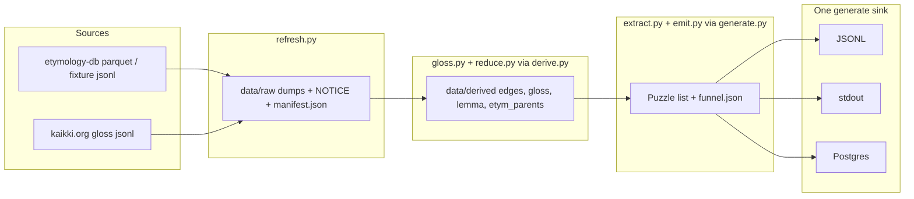
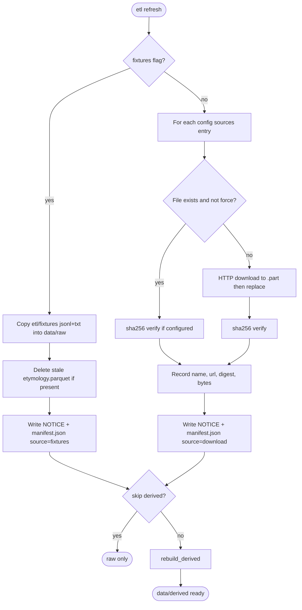
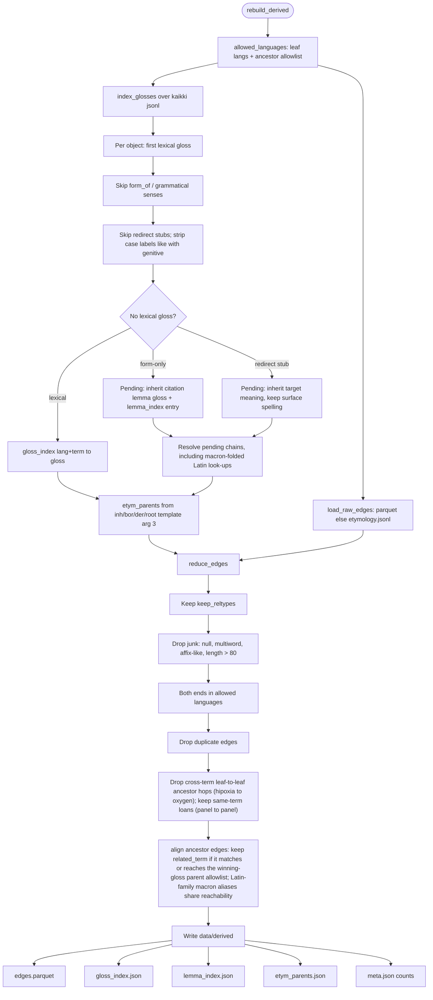
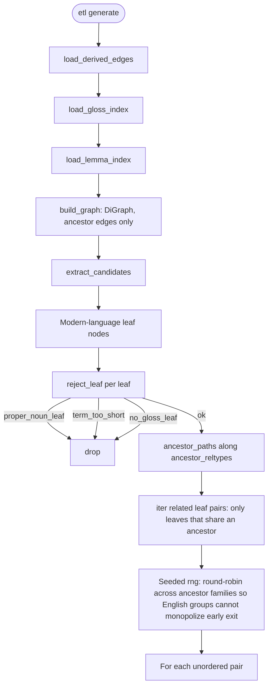
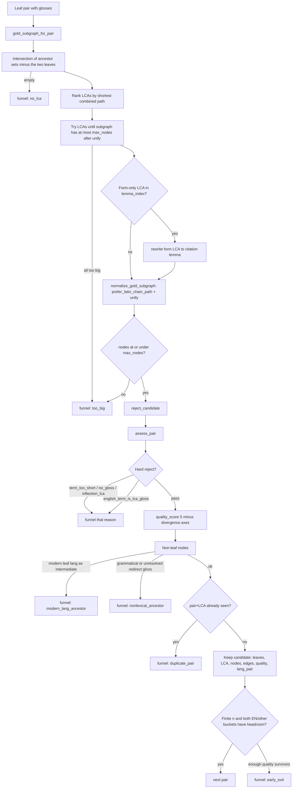
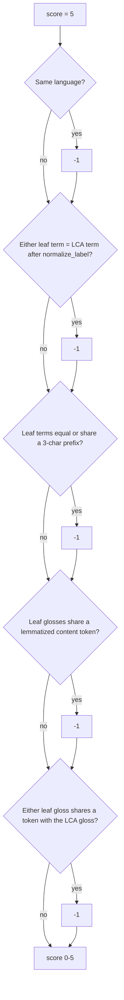
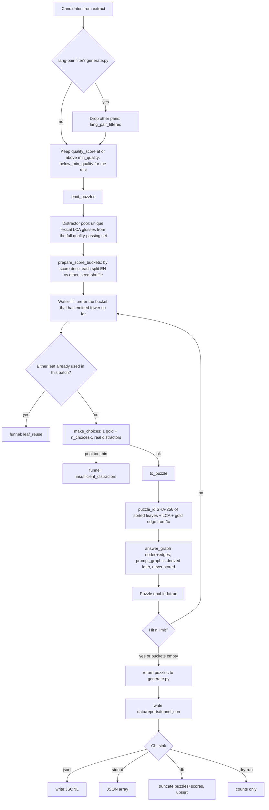
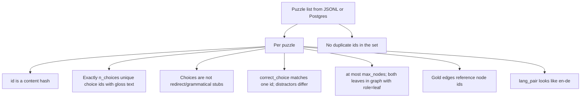

# Puzzle pipeline

Python stages that turn Wiktionary dumps into pregenerated puzzles. The Go API never walks this graph; it only reads the rows this package emits.

CLI: `uv run etl refresh` then `uv run etl generate`. Command flags and quality axes are in [`etl/README.md`](../README.md).

## End to end

`refresh` downloads (or copies fixtures) and then calls `rebuild_derived()`. `generate` does **not** download; it errors if derived artifacts are missing. `validate.py` is a schema check on already-built puzzles (`etl validate` / `etl load`), not a generate stage.

---

## 1. Refresh — `refresh.py`

---

## 2. Derive — `gloss.py` + `reduce.py` via `derive.py` `rebuild_derived`

Gloss indexing runs **before** graph reduce so etymology templates from the winning gloss can align ancestor edges.

Walks toward ancestors later use only `inherited_from` / `borrowed_from` / `derived_from` / `root` (`ancestor_reltypes`). Cognate / doublet edges are kept in the parquet but are not used for LCA paths.

---

## 3. Generate — `extract.py` + `emit.py` via `generate.py`

### Load and extract

### One leaf pair → candidate

`assess_pair` hard-filters only structural LCA problems and “English term ≡ LCA gloss head”. Same-language / similar-spelling / shared-meaning are **scored**, not dropped here.

### Quality axes — `quality.py`

Start at 5; −1 per miss; cheap → expensive; may early-exit vs `--min-quality` (default 4).

Meaning axes use `simplemma` English lemmas. Spelling axes do not.

### Filter then emit

Lang-pair and quality cuts live in `generate.py`. Water-fill emit lives in `emit.py`. Funnel write and sinks are CLI / `generate.py` after `emit_puzzles` returns.

Placeholders are never used for multiple choice. Canonical gold is `answer_graph` only.

---

## 4. Validate — `validate.py`

Used by `etl validate` and `etl load`, not by `generate` itself.

---

## Funnel reasons

| Reason | When |
|---|---|
| `proper_noun_leaf` | EN/ES/PT leaf starts with an uppercase letter (German exempt) |
| `term_too_short` | Leaf or LCA headword shorter than 3 characters |
| `no_gloss_leaf` / `no_gloss` | Missing leaf or LCA gloss |
| `no_lca` | Pair shares no ancestor |
| `too_big` | Connecting subgraph over `max_nodes` |
| `inflection_lca` | LCA gloss still looks grammatical |
| `english_term_is_lca_gloss` | English leaf term = first content token of the LCA gloss |
| `modern_lang_ancestor` | Intermediate node in EN/ES/PT/DE |
| `nonlexical_ancestor` | Intermediate gloss is grammatical or an unresolved redirect |
| `duplicate_pair` | Same leaves + LCA already kept |
| `below_min_quality` | Soft score under `--min-quality` |
| `lang_pair_filtered` | Failed `--lang-pair` |
| `leaf_reuse` | `(lang, term)` already emitted in this batch |
| `insufficient_distractors` | Fewer than 3 other real LCA glosses |
| `early_exit` | Finite `--n`; enough quality survivors in EN/other buckets |

---

## Modules

| File | Role |
|---|---|
| `refresh.py` | Fetch or copy dumps into `data/raw/` |
| `gloss.py` | Gloss / lemma / etym-parent indexes from kaikki dumps |
| `reduce.py` | Filter etymology edges and align to winning-gloss parents |
| `derive.py` | Orchestrate gloss+reduce into `data/derived/` |
| `extract.py` | Graph walk, LCA selection, hard filters, candidates |
| `quality.py` | Soft 0–5 divergence score + `assess_pair` hard rejects |
| `emit.py` | Distractors, water-fill emit, puzzle rows |
| `generate.py` | Orchestrate load → extract → emit; funnel / timings |
| `validate.py` | Schema check for JSONL / Postgres rows |
